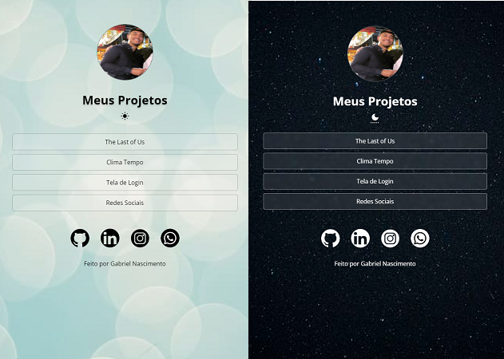

<h1> Meu Projeto Rocketseat </h1>

<h2> Tecnologias Utilizadas </h2>

<ul>
    <li> HTML5
    <li> CSS3
    <li> JavaScript
    <li> Figma
</ul>

<h3> Observações </h3>

 
    Esse projeto foi desenvolvido ao final do curso discover da rocketseat e nele apresenta links para meus outros projetos desenvolvidos, um modo claro e um modo escuro, além de outros links para redes sociais e contato. Estou sempre buscando conhecimento e esse é apenas um dos projetos em que ele é posto em prática. 

    Link para o projeto hospedado: <a href="https://bielnascf.github.io/about-me/" target="_blank" rel="external" style="text-decoration: underline;"> About Me. </a>

